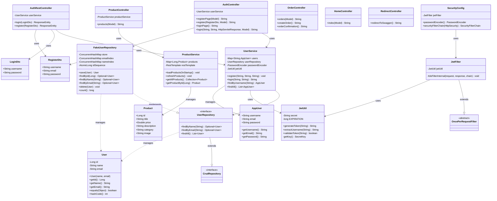

# CloudStore

Short description of what this application does.


---

## Table of Contents

- [Requirements](#requirements)
- [Environments](#environments)
- [Running Locally](#running-locally)
- [Running Tests](#running-tests)
- [CI/CD](#cicd)
- [Releasing to Production](#releasing-to-production)

---

## Requirements

- Java 21+
- Gradle (wrapper included)
- PostgreSQL (staging & production only)

---

## Environments

| Profile  | Database    | Purpose                        |
|----------|-------------|--------------------------------|
| `dev`    | H2 in-memory | Local development, no setup required |
| `stage`  | PostgreSQL  | Pre-production validation      |
| `prod`   | PostgreSQL  | Live production environment    |

---

## Running Locally

The default profile is `dev`. H2 starts automatically — no database installation needed.

```bash
./gradlew bootRun
```

To run against a specific profile:

```bash
./gradlew bootRun --args='--spring.profiles.active=stage'
```

### Environment Variables (stage & prod)

| Variable              | Description              |
|-----------------------|--------------------------|
| `DB_URL`              | JDBC connection URL      |
| `DB_USERNAME`         | Database username        |
| `DB_PASSWORD`         | Database password        |

Example:

```bash
export DB_URL=jdbc:postgresql://localhost:5432/mydb
export DB_USERNAME=myuser
export DB_PASSWORD=secret
./gradlew bootRun --args='--spring.profiles.active=prod'
```

### H2 Console (dev only)

The H2 web console is available at `http://localhost:8080/h2-console` when running in `dev`.

| Field    | Value                          |
|----------|-------------------------------|
| JDBC URL | `jdbc:h2:mem:testdb`          |
| Username | `sa`                          |
| Password | *(leave blank)*               |

---

## Running Tests

Tests run against H2 and require no external database.

```bash
./gradlew check
```

To force re-execution when nothing has changed:

```bash
./gradlew check --rerun-tasks
```

---

## CI/CD

Tests are run automatically on every push and pull request via GitHub Actions.

**Workflow:** `.github/workflows/ci.yml`

| Trigger        | Action              |
|----------------|---------------------|
| `push`         | Runs `./gradlew check` |
| `pull_request` | Runs `./gradlew check` |

Status badge — add to the top of this README once the workflow has run once:

```markdown

```

---

## Releasing to Production

Deployments to production are triggered by publishing a **GitHub Release**.

### Steps

1. Ensure all changes are merged to `main` and CI is green.

2. Go to **GitHub → Releases → Draft a new release**.

3. Fill in the release details:

   | Field           | Description                                              |
      |-----------------|----------------------------------------------------------|
   | **Tag**         | Semantic version, e.g. `v1.2.0`                         |
   | **Title**       | Short summary, e.g. `v1.2.0 — Add user registration`    |
   | **Description** | Changelog for this release (features, fixes, notes)     |

4. Click **Publish release**.

This triggers the `release` workflow (`.github/workflows/release.yml`), which builds and deploys to production.

> **Note:** The release description is required. Releases published without a description will be rejected by the workflow.

### Versioning

This project follows [Semantic Versioning](https://semver.org/):

```
v<MAJOR>.<MINOR>.<PATCH>

MAJOR — breaking changes
MINOR — new features, backwards compatible
PATCH — bug fixes
```
## model

